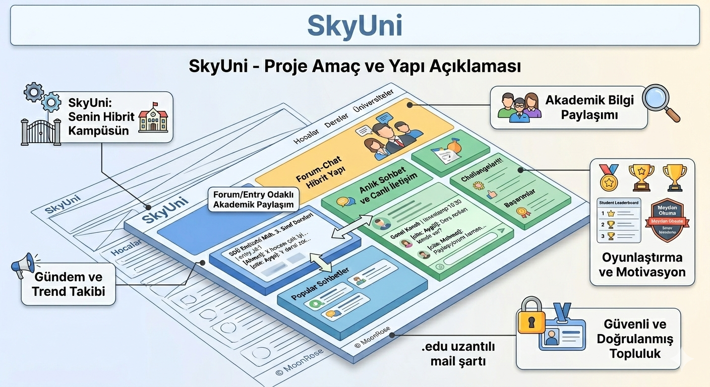

PROJE ADI: SkyUni

SkyUni, üniversite öğrencilerinin hem akademik hem de sosyal hayatını dijitale taşıyan, sadece öğrencilere özel kapalı bir ağdır. 
Temelde Ekşi Sözlük'teki bilgi paylaşımı ve başlık kültürünü alıp, Discord'un çoklu kanal yapısı ve dinamizmiyle harmanlıyor. 

**Üniversite Öğrencilerine Özel Yeni Nesil Etkileşim Platformu**

---

## Proje Hakkında

**Proje Tanımı:** > SkyUni, üniversite öğrencilerinin hem akademik hem de sosyal hayatını dijitale taşıyan, sadece öğrencilere özel kapalı bir ağdır. 
Temelde Ekşi Sözlük'teki bilgi paylaşımı ve başlık kültürünü alıp, Discord'un çoklu kanal yapısı ve dinamizmiyle harmanlıyor. 
Öğrenciler burada hem üniversiteler arası fikir alışverişi yapabiliyor hem de ders ve hoca değerlendirmeleriyle birbirlerine rehberlik ediyor. 
"Challenge" sistemiyle de sosyalleşmeyi oyunlaştırarak kampüs hayatını tek bir platformda birleştiriyor. 
Sadece .edu uzantılı mail ile kayıt olunabilen, güvenli ve onaylı bir öğrenci topluluğudur.

**Proje Kategorisi:** > Sosyal Ağ / Eğlence Platformu

**İlham Alınan Siteler** > [Discord](https://Discord.com/) ve [Ekşi Sözlük](https://eksisozluk.com/)

---

## Proje Linkleri

- **REST API Adresi:** (Geliştirme Aşamasında)
- **Web Frontend Adresi:** (Geliştirme Aşamasında)

---

## Proje Ekibi

**Grup Adı:** > MoonRose

**Ekip Üyesi:** - Aygül AYDOĞDU

---

## Dokümantasyon

Proje dokümantasyonuna aşağıdaki linklerden erişebilirsiniz:

1. [Gereksinim Analizi](Gereksinim_Analizi.md)
