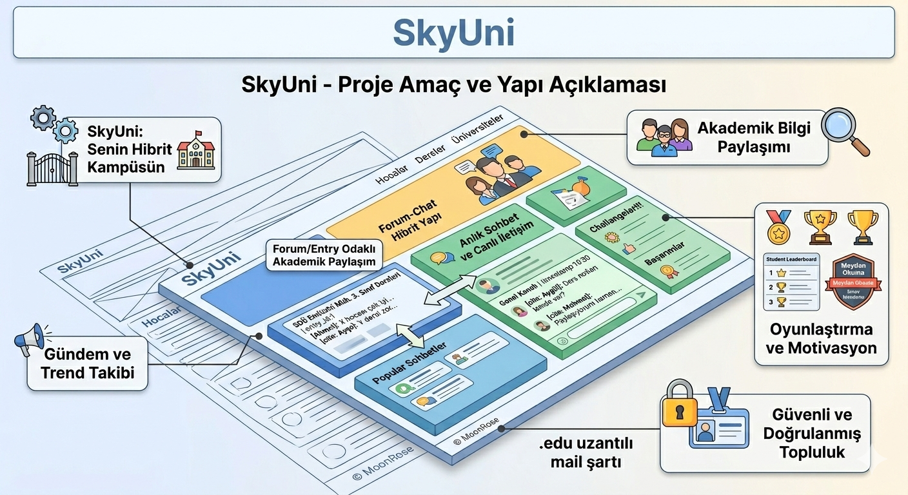

PROJE ADI: SkyUni

SkyUni, üniversite öğrencilerinin hem akademik hem de sosyal hayatını dijitale taşıyan, sadece öğrencilere özel kapalı bir ağdır. 
Temelde Ekşi Sözlük'teki bilgi paylaşımı ve başlık kültürünü alıp, Discord'un çoklu kanal yapısı ve dinamizmiyle harmanlıyor. 

**Üniversite Öğrencilerine Özel Yeni Nesil Etkileşim Platformu**

---

## Proje Hakkında

**Proje Tanımı:** SkyUni, üniversite öğrencilerinin hem akademik hem de sosyal hayatını dijitale taşıyan, sadece öğrencilere özel kapalı bir ağdır. 

**Proje Kategorisi:** Sosyal Ağ / Eğlence Platformu

**İlham Alınan Siteler:** [Discord](https://Discord.com/) ve [Ekşi Sözlük](https://eksisozluk.com/)

---

## Proje Linkleri

- **REST API Adresi:** (Geliştirme Aşamasında)
- **Web Frontend Adresi:** (Geliştirme Aşamasında)

---

## Proje Ekibi

**Grup Adı:** MoonRose

**Ekip Üyesi:** Aygül AYDOĞDU

---

## Dokümantasyon

1. [Gereksinim Analizi](Gereksinim_Analizi.md)